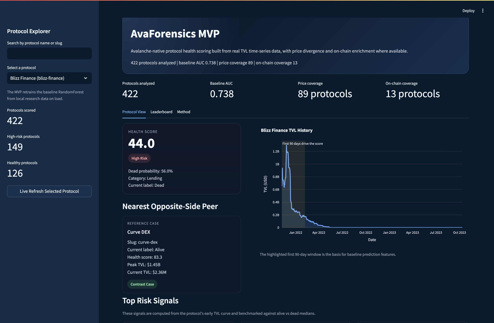

# AvaForensics

> Avalanche protocol lifecycle analysis with early-risk scoring, AVAX footprint reading, and evidence-backed interpretation.

[](https://build.avax.network/build-games)
[](https://python.org)
[](#current-snapshot)
[](#stage-1-early-risk-model)
[](LICENSE)

Live app: [avaforensics.streamlit.app](https://avaforensics.streamlit.app/)

[](https://avaforensics.streamlit.app/)

## What It Is

AvaForensics is an **Avalanche protocol lifecycle analysis tool**.

It does not try to be a contract auditing product or a rug-pull detector. Instead, it answers a different question:

**Given a protocol's early AVAX-side behavior and its current Avalanche footprint, what kind of lifecycle state does it look to be in now?**

The current product combines four layers:

- **Early Risk**: a Stage 1 model that scores whether a protocol's first 90 days of AVAX core TVL behavior look like later structural decay
- **Current AVAX Footprint**: how much meaningful presence the protocol still has on Avalanche today
- **Lifecycle Interpretation**: whether the protocol now looks more like terminal decay, multichain relocation, native revival, AVAX-side weakness, or no strong terminal signal
- **Evidence Level**: how strongly that lifecycle interpretation is supported by Avalanche-specific address, methodology, or activity evidence

## Why It Exists

Many Web3 tools answer questions like:

- does this contract have an obvious backdoor?
- was the protocol exploited?
- is the token price down?

AvaForensics is aimed at a different operational problem:

- is this protocol's AVAX-side lifecycle weakening?
- is it actually dying, or just relocating cross-chain?
- does it still have meaningful Avalanche presence?

This makes AvaForensics closer to a lifecycle intelligence tool than a generic TVL dashboard.

## Current Snapshot

Current product state after `dataset v2` and `model v2`:

- total protocols in registry: `428`
- AVAX core-eligible protocols: `421`
- currently scored, model-ready protocols in the product: `415`
- not core eligible: `6`
- data incomplete: `1`

Current mode counts:

- `terminal_global_decay = 176`
- `resilient_or_unproven = 171`
- `native_revival_or_threshold_boundary = 48`
- `multichain_relocation = 18`
- `avax_side_decay_but_globally_alive = 8`
- `not_core_eligible = 6`
- `data_incomplete = 1`

## Product Surfaces

### 1. Protocol View

For any selected protocol, the UI shows:

- a summary bar with lifecycle interpretation and evidence level
- an **Early Risk** card from the Stage 1 model
- a **Lifecycle Interpretation** card from Stage 2 + evidence layer
- an activation-adjusted AVAX core TVL history chart
- early-window risk signals
- optional expanded context, including live refresh and Avalanche on-chain context

### Homepage

When no protocol is selected, the homepage is intentionally lightweight:

- a product definition
- four global metrics
- three action cards
- two example shortcuts

It is designed to open as a product home rather than a pre-selected protocol report.

### 2. Leaderboard

The leaderboard supports two reading modes:

- **Early Risk Ranking**
- **Lifecycle Interpretation**

This allows the product to be used either as:

- an early-warning ranking tool
- or a lifecycle scanning tool

### 3. Method

The product includes a `Method` tab that explains:

- what Stage 1 predicts
- what Stage 2 means
- what evidence level means
- why a high early score does not automatically imply strong current AVAX health

## Stage 1 Early-Risk Model

### What It Predicts

Stage 1 does **not** predict open-ended final death.

It predicts a bounded event:

**Will this protocol enter structural decay within the next 365 days, based only on its first 90 days of AVAX core TVL behavior?**

This is the main model currently driving the product's score.

### How the Product Score Is Computed

The product computes:

- `health_score = 100 * (1 - stage1_terminal_prob)`

Current risk bands:

- `score >= 75` -> `Resilient Start`
- `50 <= score < 75` -> `Mixed Start`
- `score < 50` -> `Fragile Start`

Important caveat:

`Resilient Start` means **low Stage 1 terminal-decay risk from the early AVAX trajectory**. It does **not** automatically mean that the protocol is currently strong on Avalanche.

### Validation

The current best Stage 1 model is the retrained RandomForest:

- training sample size: `282`
- 5-fold CV AUC: `0.896`
- OOF AUC: `0.888`
- OOF Accuracy: `0.801`
- OOF Brier: `0.131`

Temporal holdout AUC:

- `0.849`
- `0.898`
- `0.893`

## Stage 2 Lifecycle Interpretation

Stage 2 is **not** the primary risk score.

It is an interpretation layer that helps explain what the protocol currently looks like, using:

- current AVAX footprint
- multichain context
- mode classification
- evidence layer outputs

The current Stage 2 interpretation space includes:

- `Terminal Decay`
- `Likely Cross-Chain Relocation`
- `Native Revival or Boundary Case`
- `AVAX-Side Weakness`
- `No Strong Terminal Signal`

## Evidence Layer

The evidence layer is one of the main recent upgrades in the project.

It was added to stop treating relocation and revival as pure soft labels.

Current evidence levels include:

- `On-Chain Supported`
- `Weak On-Chain Support`
- `Address Registered`
- `Methodology Backed`
- `Threshold Only`
- `Inference Only`
- `Model Only`

Current evidence posture:

### Multichain Relocation

All relocation cases are now covered by:

- `Address Registered = 8`
- `Methodology Backed = 10`

### AVAX-Side Decay But Globally Alive

All AVAX-side weakness cases are now covered by:

- `Address Registered = 6`
- `Methodology Backed = 2`

### Native Revival or Boundary

Native revival is now split across:

- `Address Registered = 19`
- `Methodology Backed = 19`
- `Weak On-Chain Support = 6`
- `On-Chain Supported = 2`
- `Threshold Only = 2`

This means native revival is no longer a single loose label. It is now a graded interpretation class.

## Data Foundation

The current product is built on `dataset v2`.

Core assets live under:

- `experiments/protocol_decay_lab/outputs/dataset_v2`
- `experiments/protocol_decay_lab/outputs/model_v2`

Important files:

- `registry_v2.csv`
- `labels_v2.csv`
- `features_summary_v2.csv`
- `early_features_v2.csv`
- `product_schema_v2.csv`

Important deployment note:

The deployed Streamlit app loads these canonical v2 outputs directly. It does not rebuild the dataset or retrain the models at boot.

Key data ideas:

- only AVAX core-eligible protocols can enter the main scoring universe
- charts use activation-adjusted AVAX core history
- Stage 1 uses early-window features only
- Stage 2 uses current-state interpretation, not primary prediction

## Data Sources

- [DeFiLlama API](https://defillama.com/docs/api): protocol metadata and TVL history
- [AvaCloud Glacier Data API](https://developers.avacloud.io/data-api/overview): Avalanche C-Chain transaction, token, and address-level data
- CoinGecko API: optional price enrichment
- Avalanche public RPC: address and live-code validation for evidence experiments

## Avalanche Tech Used

Avalanche-specific usage in the current product:

- Avalanche core TVL histories are the main modeling substrate
- Avalanche public RPC is used for address and live-code validation in the evidence layer
- AvaCloud Glacier Data API is used for live on-chain summaries
- Avalanche contract and address mapping are used to harden lifecycle interpretations

## Run Locally

```bash
git clone https://github.com/yangyuwen-bri/AvaForensics.git
cd AvaForensics
pip install -r requirements.txt
streamlit run streamlit_app.py
```

Open:

- `http://localhost:8501`
- [https://avaforensics.streamlit.app/](https://avaforensics.streamlit.app/)

Optional environment setup for Avalanche live on-chain data:

```bash
cp .env.example .env
# add GLACIER_API_KEY to .env
```

Without `GLACIER_API_KEY`, the product still works. Only the Avalanche live on-chain summary layer is unavailable.

## Repository Map

```text
AvaForensics/
├── avaforensics/                 # product backend helpers
├── avax_data/                    # legacy local data assets still used by parts of the app
├── experiments/
│   └── protocol_decay_lab/
│       ├── src/                  # dataset v2, model v2, evidence-layer research scripts
│       └── outputs/              # canonical v2 dataset and model outputs
├── scripts/                      # older pipeline / ingestion entry points
├── streamlit_app.py              # product UI
├── docs/
│   ├── TECHNICAL_IMPLEMENTATION.md
│   ├── DEPLOYMENT.md
│   └── SUBMISSION_CHECKLIST.md
└── requirements.txt
```

## Research Backbone

The current product is backed by the `protocol_decay_lab` research track:

- `rebuild_dataset_v2.py` rebuilds the clean AVAX-core universe
- `protocol_decay_lab.py` defines early-window features and the structural-decay event
- `retrain_v2_models.py` retrains the Stage 1 model and Stage 2 interpretation assets
- `build_product_schema_v2.py` assembles the product-facing schema
- address and activity experiments strengthen evidence levels for relocation, native revival, and AVAX-side weakness

## Technical Notes

Detailed technical implementation notes are documented in [docs/TECHNICAL_IMPLEMENTATION.md](/Users/yuwen/AvaForensics/docs/TECHNICAL_IMPLEMENTATION.md).

Deployment notes are documented in [docs/DEPLOYMENT.md](/Users/yuwen/AvaForensics/docs/DEPLOYMENT.md).

## Current Limitations

The product is substantially stronger than the first MVP, but it is still not a full production platform.

- Stage 1 is a bounded early-warning model, not a final destiny predictor
- Stage 2 is an interpretation layer, not the primary risk score
- not every lifecycle interpretation is fully on-chain proven
- the protocol registry is still partially anchored to third-party sources
- live on-chain enrichment still covers a smaller subset than the full scored universe

## Current Product Read

The cleanest way to interpret the product today is:

- **Stage 1** = early-warning risk model
- **Current AVAX Footprint** = present Avalanche presence layer
- **Stage 2** = lifecycle interpretation layer
- **Evidence Level** = interpretation strength layer

That separation is the core design choice of the current AvaForensics product.

## Build Games Context

Built for [Avalanche Build Games 2026](https://build.avax.network/build-games), Stage 2 MVP.

## License

MIT. See [LICENSE](/Users/yuwen/AvaForensics/LICENSE).
