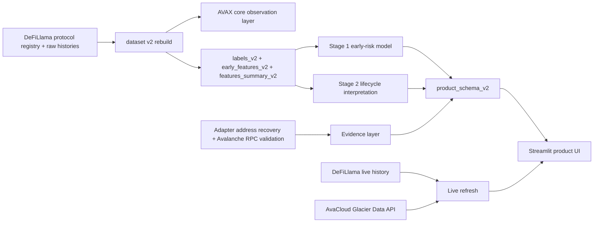

# Technical Implementation

## Scope

This document describes the current AvaForensics product as it exists in this repository after the `dataset v2` and `model v2` refresh.

The product is best understood as an **Avalanche protocol lifecycle analysis tool**. It is not:

- a contract auditing engine
- a fraud or rug-pull detector
- a generic multi-chain TVL dashboard

It combines:

- an **early-risk model** built from the first 90 days of AVAX core TVL behavior
- a **current AVAX footprint layer**
- a **Stage 2 lifecycle interpretation layer**
- an **evidence layer** that grades how strongly some lifecycle interpretations are supported

## System Overview

## Product Definition

At runtime, AvaForensics answers four different questions:

1. **Early Risk**
   - Based on a protocol's first 90 days of AVAX core TVL behavior, how likely is it to enter structural decay over the next year?

2. **Current AVAX Footprint**
   - How much meaningful presence does the protocol still have on Avalanche today?

3. **Lifecycle Interpretation**
   - Does the current state look more like terminal decay, multichain relocation, native revival, AVAX-side weakness, or no strong terminal signal?

4. **Evidence Level**
   - How strongly is that lifecycle interpretation supported by Avalanche-specific evidence?

These layers should not be collapsed into a single verdict.

## Data Foundation

### 1. Protocol Universe

The current product no longer scores every Avalanche-tagged protocol blindly. It uses the `dataset v2` universe split:

- `core_eligible`
- `not_core_eligible`
- `data_incomplete`
- `model_not_ready`

Current counts:

- total protocols in registry: `428`
- AVAX core-eligible protocols: `421`
- currently scored, model-ready protocols in product: `415`
- not core eligible: `6`
- data incomplete: `1`

### 2. Observation Semantics

The product now distinguishes between:

- raw observations
- activation-adjusted AVAX core history
- product display history

Key rules:

- charts use **activation-adjusted AVAX core TVL history**
- pre-activation zero periods are hidden from the displayed history
- long observation gaps are broken instead of being drawn as continuous ramps
- Stage 1 only scores protocols with a valid early window

Related product notes are documented in:

- `docs/OBSERVATION_SEMANTICS_V1.md`

### 3. dataset v2 Assets

Primary v2 data assets live under:

- `experiments/protocol_decay_lab/outputs/dataset_v2`

Important files:

- `registry_v2.csv`
- `labels_v2.csv`
- `features_summary_v2.csv`
- `early_features_v2.csv`
- `observations/*.csv`

These assets are the product's current canonical source for:

- protocol eligibility
- current AVAX status
- structural decay labels
- activation-aware histories
- model-ready early features

## Stage 1: Early Risk Model

### What It Predicts

Stage 1 does **not** predict "final death" in an open-ended sense.

It predicts a bounded event:

**Whether a protocol will enter `structural_decay` within the next 365 days, based only on its early AVAX core TVL behavior.**

This makes Stage 1 a true early-warning model, not a current-state classifier.

### Windowing Rules

Stage 1 uses:

- `EARLY_WINDOW_DAYS = 90`
- `MIN_EARLY_POINTS = 30`

The model:

1. finds AVAX activation
2. trims history to the activation start
3. takes the first 90 days
4. rejects the protocol if fewer than 30 valid points exist

### Label Definition

The positive event is `structural_decay`.

A protocol is labeled positive when, after the early window:

- it enters a future window within the next `365` days
- it spends at least `30` consecutive days below the decay threshold
- and it does not show strong recovery afterward

Core constants:

- `PREDICT_HORIZON_DAYS = 365`
- `SUSTAIN_DAYS = 30`
- `ABSOLUTE_DECAY_TVL = 10_000`
- `RELATIVE_DECAY_FROM_EARLY_PEAK = 0.05`
- `RECOVERY_MULTIPLIER = 2.0`

### Features

Stage 1 uses early-window time-series features extracted from AVAX core TVL, including:

- log start / peak / end TVL
- retention ratio
- drawdown ratio
- peak timing
- overall slope and post-peak slope
- volatility of log returns
- downside return behavior
- crash and rebound counts
- active day fraction
- nonzero day fraction
- rolling 7-day end-versus-peak ratio
- peak-to-median gap

These are implemented in:

- `experiments/protocol_decay_lab/src/protocol_decay_lab.py`

### Model Family

The product currently uses the retrained `RandomForest` as the primary Stage 1 model.

Training setup:

- model: `RandomForestClassifier`
- `n_estimators = 500`
- `min_samples_leaf = 4`
- `class_weight = balanced`
- median imputation

### Validation

Current Stage 1 validation results come from:

- `experiments/protocol_decay_lab/outputs/model_v2/stage1_model_leaderboard_v2.csv`
- `experiments/protocol_decay_lab/outputs/model_v2/stage1_temporal_validation_v2.csv`

Best model:

- model: `rf`
- training sample size: `282`
- 5-fold CV AUC: `0.896`
- OOF AUC: `0.888`
- OOF Accuracy: `0.801`
- OOF Brier: `0.131`

Temporal holdout AUC:

- split `0.5`: `0.849`
- split `0.7`: `0.898`
- split `0.8`: `0.893`

### Product Mapping

In the product:

- `dead_probability = stage1_terminal_prob`
- `health_score = 100 * (1 - dead_probability)`

Risk band thresholds:

- `score >= 75` -> `Resilient Start`
- `50 <= score < 75` -> `Mixed Start`
- `score < 50` -> `Fragile Start`

Important caveat:

`Resilient Start` means **low Stage 1 terminal-decay risk from the early AVAX trajectory**. It does **not** automatically mean strong current AVAX health.

## Current AVAX Footprint Layer

The product separately tracks the current Avalanche footprint of a protocol using:

- `current_avax_core_tvl`
- `current_total_core_tvl`
- `current_non_avax_core_tvl`
- `current_avax_share`
- `current_status`

This layer is intentionally separate from Stage 1 because a protocol can:

- have strong early AVAX behavior
- but now retain only a thin AVAX footprint

This is the reason the product shows:

- `Early Risk`
- `Current AVAX Footprint`

as distinct concepts.

## Stage 2: Lifecycle Interpretation

### Role

Stage 2 is **not** the primary prediction layer.

It is a **lifecycle interpretation layer** that helps explain what the protocol now looks like, given:

- current AVAX footprint
- multichain context
- mode classification
- evidence layer outputs

### Current Mode Space

The product currently uses these Stage 2 modes:

- `terminal_global_decay`
- `multichain_relocation`
- `native_revival_or_threshold_boundary`
- `avax_side_decay_but_globally_alive`
- `resilient_or_unproven`
- `not_core_eligible`
- `data_incomplete`

Current counts from `product_schema_v2_summary.csv`:

- `terminal_global_decay = 176`
- `resilient_or_unproven = 171`
- `native_revival_or_threshold_boundary = 48`
- `multichain_relocation = 18`
- `avax_side_decay_but_globally_alive = 8`
- `not_core_eligible = 6`
- `data_incomplete = 1`

### Why Stage 2 Is Not the Main Score

Stage 2 uses current-state features and mode definitions that are partly tied to current protocol status.

That makes Stage 2 highly useful for interpretation, but not equivalent to an independent early-warning model.

The product therefore treats Stage 2 as:

- interpretation
- classification
- evidence-backed context

not as the primary risk score.

## Evidence Layer

### Purpose

The evidence layer was added to move `multichain_relocation`, `native_revival`, and `avax_side_decay` away from pure label inference and toward product-grade support.

It combines:

- adapter-source recovery
- Avalanche address registration
- `eth_getCode` validation
- short-window Avalanche activity checks
- adapter methodology evidence

### Current Evidence Levels

The product uses these evidence labels:

- `On-Chain Supported`
- `Weak On-Chain Support`
- `Address Registered`
- `Methodology Backed`
- `Threshold Only`
- `Inference Only`
- `Model Only`
- `Address Gap`
- `Address Mismatch`
- `Not Eligible`

### Current Evidence Posture

From `product_schema_v2_summary.csv`:

#### Multichain Relocation

All relocation cases are now supported by:

- `Address Registered = 8`
- `Methodology Backed = 10`

#### AVAX-Side Decay But Globally Alive

All current AVAX-side decay cases are now supported by:

- `Address Registered = 6`
- `Methodology Backed = 2`

#### Native Revival or Boundary

Native revival is now split into:

- `Address Registered = 19`
- `Methodology Backed = 19`
- `Weak On-Chain Support = 6`
- `On-Chain Supported = 2`
- `Threshold Only = 2`

This means the native revival line is no longer a single soft label. It is now a mixed evidence class ranging from threshold-only boundary cases to stronger Avalanche-specific support.

### Product Meaning

Evidence level answers:

**How hard is the lifecycle interpretation?**

It does not automatically convert the interpretation into final truth, but it materially changes how much confidence the UI should present.

## Product Output Schema

The current product-facing schema is built in:

- `experiments/protocol_decay_lab/src/build_product_schema_v2.py`

Main output:

- `experiments/protocol_decay_lab/outputs/model_v2/product_schema_v2.csv`

Important fields:

- `terminal_risk`
- `decay_mode`
- `evidence_level`
- `evidence_summary`
- `address_registry_status`
- `current_avax_core_tvl`
- `current_total_core_tvl`
- `current_avax_share`

This schema is what the Streamlit product consumes to construct:

- summary bar
- early risk card
- lifecycle interpretation card
- leaderboard lifecycle view

## Streamlit Product Runtime

### Entry Point

- `streamlit_app.py`

### Backend

- `avaforensics/mvp.py`

Main responsibilities:

- load v2 datasets and model outputs
- map product schema into protocol views
- compute Stage 1 health score and risk band
- build lifecycle interpretation and evidence labels
- render leaderboard-compatible frames
- build activation-adjusted histories for protocol charts
- run optional live refresh

### Product Views

The current UI is organized around:

- protocol detail view
- early-risk leaderboard
- lifecycle interpretation leaderboard
- method page

The protocol page is intentionally split into:

- one summary line
- `Early Risk`
- `Lifecycle Interpretation`
- AVAX core TVL chart
- `Why This Looks Risky`
- more context

## Live Refresh Layer

The app still includes a runtime live-refresh overlay. This remains separate from the reproducible v2 model foundation.

Live sources:

- DeFiLlama live TVL history
- AvaCloud Glacier Data API

Live refresh is used for:

- current TVL refresh
- live monitor score
- Avalanche live on-chain summary

It is **not** used to silently mutate the baseline Stage 1 model.

## Current Product Boundaries

What the product can do well now:

- score early AVAX trajectory risk
- separate current AVAX footprint from early risk
- classify lifecycle modes
- grade evidence for relocation, native revival, and AVAX-side weakness

What it still does not do:

- prove future failure with certainty
- replace contract audits
- provide a fully self-owned Avalanche registry
- claim every Stage 2 mode as on-chain ground truth

## Main Takeaway

The current AvaForensics implementation should be read as:

- **Stage 1** = early-warning risk model
- **Current AVAX Footprint** = present Avalanche presence layer
- **Stage 2** = lifecycle interpretation layer
- **Evidence Level** = interpretation strength layer

This separation is the core technical design choice of the current product.
