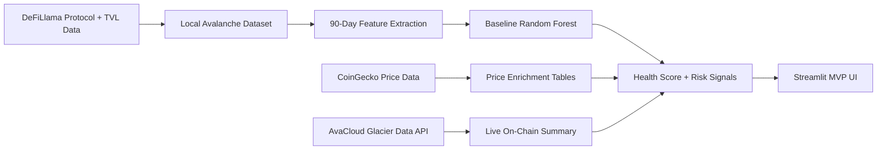

# Technical Implementation

## Scope

This document describes the current AvaForensics MVP as implemented in this repository.

The MVP is a protocol-health explorer, not a contract auditing engine and not a full production risk platform.

## System Overview

## Data Layers

### 1. Protocol Registry

Primary file:

- `avax_data/protocols_labeled.csv`

Purpose:

- Defines the protocol universe used in the MVP
- Stores current label and metadata used by the product

Important fields:

- `slug`
- `name`
- `category`
- `num_chains`
- `avax_only`
- `tvl_usd`
- `label`

### 2. Raw TVL Histories

Primary files:

- `avax_data/tvl_{slug}.csv`

Purpose:

- Canonical local source for historical TVL curves in the MVP
- Used for charts and feature extraction

### 3. Derived Feature Tables

Primary files:

- `avax_data/features_summary.csv`
- `avax_data/early_features.csv`

Purpose:

- `features_summary.csv`: product-side summaries such as drawdown and recent TVL changes
- `early_features.csv`: model-ready first-90-day features

### 4. Optional Enrichment

Primary files:

- `avax_data/combined_features.csv`
- `avax_data/onchain_features.csv`

Purpose:

- Price divergence enrichment
- Avalanche on-chain activity enrichment

## Baseline Scoring Pipeline

### Objective

Predict whether a protocol behaves more like the low-TVL/dead set using only its early TVL behavior.

### Model Inputs

The current baseline uses features derived from the first 90 days of TVL behavior, including:

- peak timing
- retention at end of window
- half-life after peak
- second-half ratio
- overall slope
- volatility
- crash count
- early peak TVL

### Model

- Random Forest classifier
- balanced class weights
- 5-fold stratified cross validation

### Output

For each protocol:

- `dead_probability`
- `health_score = 100 * (1 - dead_probability)`
- `risk_band`

## Product Runtime

### Entry Point

- `streamlit_app.py`

### Backend Helpers

- `avaforensics/mvp.py`

Responsibilities:

- load local datasets
- train the baseline model
- prepare leaderboard data
- prepare protocol detail views
- perform live refresh for the selected protocol

### Pipeline Scripts

The offline data pipeline scripts are grouped under `scripts/`:

- `scripts/fetch_tvl_history.py`
- `scripts/timeseries_features_model.py`
- `scripts/coingecko_price_features.py`
- `scripts/glacier_onchain_features.py`

This keeps product code and one-off pipeline code separated:

- `avaforensics/` contains reusable app logic
- `scripts/` contains data ingestion and feature engineering entry points

## Live Refresh Layer

The MVP includes a monitoring overlay that is intentionally separate from the baseline training dataset.

### Why It Is Separate

The baseline model is meant to remain reproducible from the local research dataset.

Live data is used as a monitoring overlay so the product can:

- show fresh TVL behavior
- show Avalanche chain facts
- avoid silently mutating the baseline research dataset at runtime

### Live Sources

- DeFiLlama for current protocol TVL history
- AvaCloud Glacier Data API for Avalanche token/address facts

### Live Outputs

When available, live refresh computes:

- refreshed health score from the current live TVL history
- live monitor score from recent TVL behavior
- Avalanche on-chain snapshot

## Avalanche Official API Usage

The current MVP uses AvaCloud Glacier Data API for:

- address metadata
- native balance lookup
- token transfer activity
- recent transaction activity

This lets the product show live Avalanche-native context without changing the baseline scoring dataset.

## Known Limitations

### Data Semantics

- The main protocol universe is still anchored to a third-party protocol registry
- The current label rule is coarse: `current TVL < 10k = dead`
- Multi-chain protocols and Avalanche-native protocols are both present in the same registry

### Coverage

- Price enrichment coverage is partial
- On-chain enrichment coverage is still limited

### Feature Hygiene

- Some derived features still contain extreme values that should be clipped or redefined before production use

## What Should Be Rebuilt Next

If AvaForensics continues beyond MVP, the next priority should be the data foundation:

1. protocol registry cleanup
2. better status and label definitions
3. stronger Avalanche-native fact layer
4. better data versioning and lineage
5. more reliable enrichment coverage
